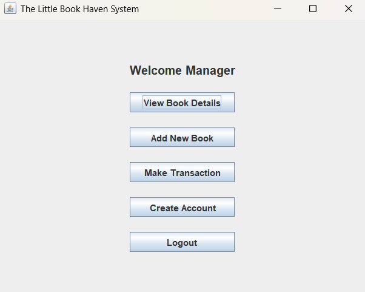
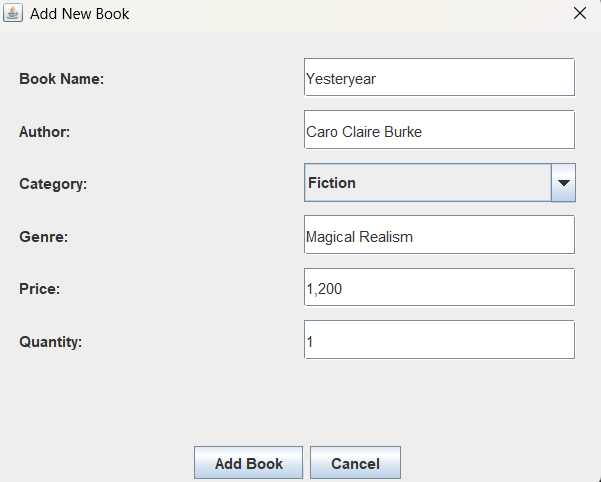
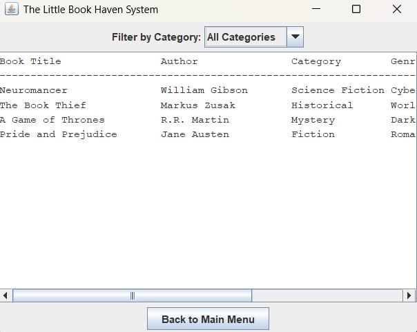
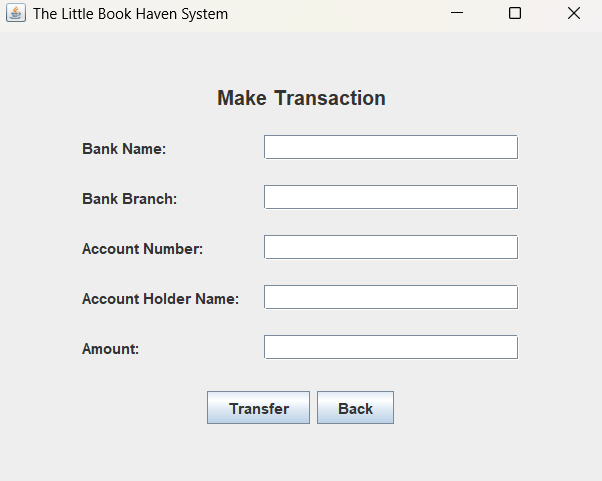

# Bookstore Management System with Transaction Simulation

## Project Description

The Bookstore Management System with Transaction Simulation is a Java-based desktop application with a graphical user interface (GUI) designed to manage book inventory efficiently.

The system allows users to perform core operations such as adding, updating, searching, and deleting book records, along with simulating basic transaction processes. It demonstrates the use of Object-Oriented Programming (OOP), file handling, and GUI development in Java.

## Technologies Used

Java
Object-Oriented Programming (OOP)
File Handling (Text Files)
NetBeans / Eclipse IDE

## Features

Add new books to the system
Search books by category and title
Update existing book details
Delete books from inventory
Store and retrieve data using text files
Simulate transactions with payment details
Manage user accounts

## How to Run

Open the project in NetBeans or Eclipse

Navigate to the main class:

thelittlebookhaven.java
Run the program
Use the GUI interface to interact with the system

## Purpose

This project was developed to:

Apply core OOP concepts such as classes and objects
Understand file handling in Java
Practice GUI development using Java Swing
Simulate a real-world bookstore management system

## Future Improvements

Add database integration (MySQL)
Improve UI/UX design
Add advanced search and filtering
Implement secure authentication system

## Author
Developed by *Krishanthan*

## Screenshots

### Manager Dashboard

### Add New Book

### Book Inventory View

### Transaction Module

